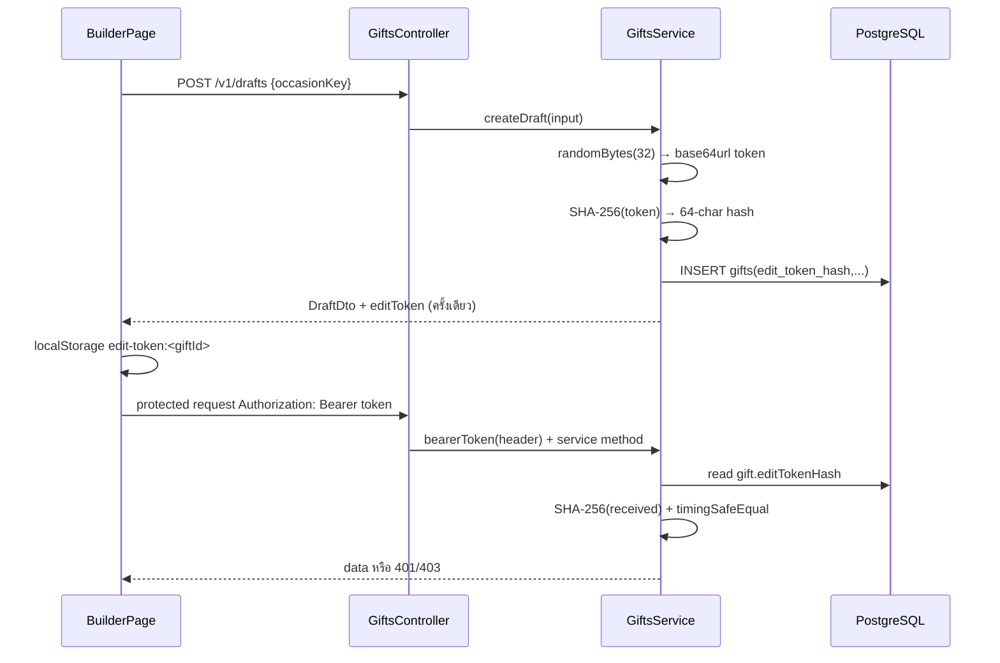

# Authentication and Security

## สรุปก่อน: ไม่มี Login

ระบบไม่มี User model, login endpoint, JWT, session, cookie, role หรือ permission matrix แบบ account. Authentication ของผู้สร้างเป็น “ใครถือ opaque edit token คนนั้นแก้ gift ได้” ส่วนผู้รับใช้ public slug เพื่อดู gift

## Guest Edit Token Flow

### Token ถูกสร้างอย่างไร

- `GiftsService.createDraft()` — `apps/api/src/gifts/gifts.service.ts:49-60`
- `randomBytes(32)` = entropy 256-bit; `.toString('base64url')` ได้ 43 ตัวอักษร
- `hashToken()` ใช้ SHA-256; DB เก็บเพียง hash
- plaintext token อยู่ใน create response เพียงครั้งเดียว

### Frontend เก็บและส่งอย่างไร

- create: `BuilderPage.chooseOccasion()` เก็บ `aporaviz-gift:edit-token:<giftId>`
- resume: `BuilderPage.ngOnInit()` อ่าน key ตาม route ID
- request: `GiftApiService.auth()` ใส่ `Authorization: Bearer <token>`
- renewal: หลัง purchase success copy token ไป key `aporaviz-gift:renew-token:<slug>` เพื่อให้ public page เดิมต่ออายุได้

### Backend parse และ verify อย่างไร

- `bearerToken()` ใน `gifts.controller.ts:98-101` รับเฉพาะ prefix `Bearer `; format อื่นกลายเป็น empty string
- `GiftsService.assertToken()`:
  - token ว่าง → `UnauthorizedException` (401)
  - hash length/constant-time compare ไม่ตรง → `ForbiddenException` (403)
  - ใช้ `timingSafeEqual` ลด timing side-channel
- ไม่มี Guard; controller/service ทุก protected flow ต้องเรียกตรวจเอง

### อายุ Token

Token ไม่มี expiry claim ในตัวเหมือน JWT. สิทธิ์ถูกจำกัดผ่าน state/time ของ Gift:

- edit operations เรียก `assertEditable()` → status ต้อง DRAFT และ `draftExpiresAt > now`
- payment read/cancel ยังตรวจ token แต่ไม่ได้ตรวจ draft expiryโดยตรง
- renewal ต้อง gift PAID, active และยังไม่หมดอายุ
- cleanup ลบ row/token hash เมื่อ gift ถูกลบ

## Authorization Matrix

| Endpoint group | Token | State rules เพิ่มเติม |
|---|---|---|
| POST `/drafts` | ไม่ใช้ | rate limit |
| GET/PATCH draft | ใช้ | PATCH ต้อง DRAFT/unexpired; GET ปัจจุบันตรวจ tokenแต่ไม่เรียก `assertEditable`, จึงอ่าน draft expired ได้จน cron ลบ |
| media reserve/confirm/delete/order | ใช้ | DRAFT/unexpired |
| purchase checkout | ใช้ | DRAFT/unexpired + template/package + READY media |
| payment get/cancel | ใช้ | owner gift |
| public gift | ไม่ใช้ | slug + PAID + `giftExpiresAt > now` |
| renewal | ใช้ | PAID + ยังไม่หมดอายุ |
| webhook | ไม่ใช้ edit token | HMAC signature/timestamp |

## Idempotency Key

Frontend สร้างด้วย `crypto.randomUUID()` และส่ง `Idempotency-Key`. Backendตรวจ length 8–128 และ DB มี unique constraint

- key เดิม + gift เดิม → คืน payment เดิม
- key เดิม + gift อื่น → 409
- ไม่ใช่ authentication: ผู้เรียกยังต้องมี edit token

## Cloudinary Credentials และ Signature

- `CLOUDINARY_API_KEY` เป็น public identifier และอยู่ใน signed upload response
- `CLOUDINARY_API_SECRET` อยู่เฉพาะ `CloudinaryService`; ใช้ sign params/SDK Admin calls; ห้ามส่ง browser
- signed upload กำหนด public ID และ authenticated asset type
- confirm phase ไม่เชื่อ upload response จาก browser แต่ query Cloudinary ด้วย server credential

รายละเอียด exact params ใน [SIGNATURE_AND_UPLOAD_FLOW.md](./SIGNATURE_AND_UPLOAD_FLOW.md)

## Opn Security

### API keys

- public test key สร้าง PromptPay source
- secret test key สร้าง/อ่าน charge ผ่าน Basic auth
- `OpnService.assertTestMode()` ยอมเฉพาะ prefix `pkey_test_`/`skey_test_`; live keysถูกปฏิเสธ

### Webhook HMAC

`PaymentsService.verifyWebhook()` ตรวจ:

1. มี `OPN_WEBHOOK_SECRET` อย่างน้อยหนึ่งค่า (รองรับ `current,previous`)
2. headers `Omise-Signature`, `Omise-Signature-Timestamp`
3. timestamp ห่างเวลาปัจจุบันไม่เกิน 300 วินาที ป้องกัน replay
4. expected = HMAC-SHA256(base64-decoded secret, `timestamp.rawBody`)
5. signature hex เทียบแบบ timing-safe

ผ่านแล้วจึง parse JSON และบันทึก unique event ID

### Payment unlock authorization

`completeVerifiedCharge()` ไม่เชื่อ webhook payloadว่า paid แต่เรียก `OpnService.getCharge()` แล้วตรวจ:

- payment อ้างอิง charge ID นี้จริง
- charge `paid=true`, `status='successful'`
- currency/amount ตรง DB
- metadata payment_id/gift_id ตรง
- purchase gift ต้อง PAYMENT_PENDING; renewal giftต้อง PAID

browser poll/redirect ไม่มีสิทธิ์เรียก `completePayment()` โดยตรง

## Network Security

- CORS จำกัด origin จาก `WEB_ORIGIN`; ไม่ใช่ authentication และ non-browser clients ข้าม CORS ได้
- Global rate limit 120/min; draft/signature/checkout/renewal มี limit แคบกว่า
- Angular SSR server ใส่ CSP, Referrer-Policy, nosniff, X-Frame-Options DENY
- CSP อนุญาต Cloudinary images, Opn image host, Google Fonts และ connect HTTPS/local API
- structured JSON console logger ถูกตั้งใน Nest bootstrap; source ไม่พบการ log edit token

## Security Limitations ที่เห็นจาก implementation

- localStorage token ถูกขโมยได้หาก origin มี XSS; ไม่มี token rotation/revoke endpoint
- ไม่มี account recovery: tokenหายหมายถึง frontend ไม่มีวิธีกู้สิทธิ์
- `GET /drafts/:id` ยังอ่าน expired draft ได้ก่อน cleanup หากมี token
- production reverse proxy/TLS/secret manager/deployment config: `Unable to determine from current source code`
- ไม่มี CSRF token; protected APIใช้ Authorization header ไม่ใช่ cookie จึงไม่ใช่ cookie-CSRF model แต่ XSS ยังเป็นความเสี่ยงหลัก
