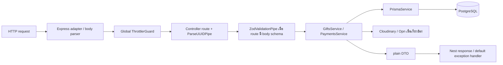
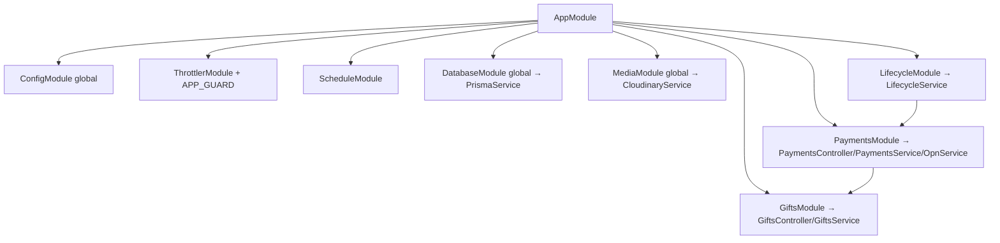

# Backend Flow

## Request Pipeline จริง

ไม่มี custom middleware, custom auth guard, interceptor หรือ exception filter ใน source ปัจจุบัน สิ่งที่ทำงานก่อน controller คือ Express/Nest built-ins, global `ThrottlerGuard`, parameter pipes และ route-specific `ZodValidationPipe`

## Bootstrap และ Global Behavior

ไฟล์ `apps/api/src/main.ts`, function `bootstrap()`:

1. `NestFactory.create(AppModule, { rawBody: true, logger: ConsoleLogger(json) })`
2. ดึง `ConfigService`
3. prefix ทุก controller route ด้วย `/v1`
4. CORS อนุญาต origin เดียวจาก `WEB_ORIGIN`, methods ที่กำหนด และ headers `Content-Type`, `Authorization`, `Idempotency-Key`
5. เปิด shutdown hooks
6. listen `PORT` หรือ 3000 บน `0.0.0.0`

`rawBody: true` สำคัญเฉพาะ Opn webhook เพราะ HMAC ต้องคำนวณจาก bytes เดิมก่อน JSON transformation

## Module / Dependency Injection Graph

Nest constructor injection ที่ใช้จริง:

- `GiftsService(PrismaService, CloudinaryService)`
- `PaymentsService(PrismaService, GiftsService, ConfigService, OpnService)`
- `LifecycleService(PrismaService, CloudinaryService, PaymentsService, ConfigService)`
- Controllers inject service ของ module ตัวเอง

## Controller → Validation → Service Matrix

ทุก path ด้านล่างมี prefix `/v1`

| HTTP | Controller method / file | Validation / headers | Service method | ผลลัพธ์หลัก |
|---|---|---|---|---|
| GET `/health` | `AppController.getHealth()` — `app.controller.ts` | ไม่มี | `AppService.getHealth()` | `{status:'ok', service:'aporaviz-gift-api'}` |
| POST `/drafts` | `GiftsController.createDraft()` | Zod `createDraftRequestSchema`; throttle 10/min | `GiftsService.createDraft()` | 201 + `CreateDraftResponse` รวม tokenครั้งเดียว |
| GET `/drafts/:giftId` | `getDraft()` | `ParseUUIDPipe`; bearer header | `getDraft()` | 200 `DraftDto` |
| PATCH `/drafts/:giftId` | `updateDraft()` | UUID + bearer + `updateDraftRequestSchema` | `updateDraft()` | 200 `DraftDto` |
| POST `/drafts/:giftId/media-reservations` | `reserveMedia()` | UUID + bearer + media schema; 20/min | `reserveMedia()` | 201 reservation + signed upload params |
| POST `/drafts/:giftId/media/:mediaId/confirm` | `confirmMedia()` | UUIDs + bearer | `confirmMedia()` | 201 `GiftMediaDto` |
| DELETE `/drafts/:giftId/media/:mediaId` | `deleteMedia()` | UUIDs + bearer | `deleteMedia()` | 204 |
| PUT `/drafts/:giftId/media-order` | `reorderMedia()` | UUID + bearer + media-order schema | `reorderMedia()` | 200 `DraftDto` |
| GET `/gifts/:slug` | `getPublicGift()` | ไม่มี token | `getPublicGift()` | 200 `PublicGiftDto` หรือ 404 |
| POST `/drafts/:giftId/checkouts/mock` | `PaymentsController.mockCheckout()` | UUID + bearer + idempotency + mock schema; 10/min | `mockCheckout()` | 201 `PaymentDto` |
| POST `/drafts/:giftId/checkouts/opn` | `opnCheckout()` | UUID + bearer + idempotency; 5/min | `opnCheckout()` | 201 pending `PaymentDto` + QR |
| GET `/payments/:paymentId` | `getPayment()` | UUID + bearer | `getPayment()` | 200 `PaymentDto` |
| POST `/payments/:paymentId/cancel` | `cancelPayment()` | UUID + bearer | `cancelPayment()` | 201 `PaymentDto` (Nest POST default) |
| POST `/gifts/:slug/renewals` | `renew()` | bearer + idempotency + discriminated Zod schema; 5/min | `renew()` | 201 `PaymentDto` |
| POST `/webhooks/opn` | `opnWebhook()` | raw body + Omise headers | `handleOpnWebhook()` | 201 `{accepted:true,...}` |

หมายเหตุ: controller ไม่ใส่ `@HttpCode(200)` สำหรับ POST webhook/cancel จึงใช้ Nest default 201 แม้เป็น acknowledgement/action

## DTO และ Validation

DTO runtime ไม่ใช่ class decorators แต่เป็น Zod schemas ใน `packages/contracts/src/index.ts`:

- create draft: occasion enum
- update: optional fields พร้อม max lengths/date/package enum
- media reservation: filename 1–255, MIME allowlist, bytes 1–10MB
- media order: UUID array 1 ถึง max package catalog
- mock checkout: success/failure
- renewal: discriminated union `provider='mock'` ต้องมี outcome; `provider='opn'` ไม่มี outcome

`ZodValidationPipe.transform()` ใช้ `safeParse`; fail แล้ว throw `BadRequestException` body `{message:'Validation failed', issues:[{path,message}]}`. Path UUID ใช้ Nest `ParseUUIDPipe` แยกต่างหาก

## Business Service Responsibilities

### `GiftsService` — `apps/api/src/gifts/gifts.service.ts`

- `createDraft()` สุ่ม token 32 bytes, hash SHA-256, create `Gift`, expiry 24h
- `getDraft()` โหลด media + ตรวจ token + map DTO
- `updateDraft()` transaction + gift advisory lock; ตรวจ template/occasion/package downgrade; update editable fields
- `reserveMedia()` transaction Serializable + lock; นับ READY/RESERVED ที่ยังไม่หมดอายุ; create reservation; ออก Cloudinary signature
- `confirmMedia()` ตรวจ editable/reservation/Cloudinary metadata แล้ว update READY
- `deleteMedia()` ลบ Cloudinary แล้ว transaction ลบ row + compact order
- `reorderMedia()` ตรวจ set ของ READY IDs ต้องตรงครบ แล้ว update order
- `getPublicGift()` query เฉพาะ PAID/unexpired, parse snapshot, สร้าง signed URLs
- `assertToken()` ตรวจ bearer token แบบ timing-safe

### `PaymentsService` — `apps/api/src/payments/payments.service.ts`

- mock/Opn purchase checkout และ idempotency
- payment read/cancel/renewal
- Opn webhook signature + event idempotency + verified charge
- reconciliation และ stale pending expiry
- `completePayment()` เป็นจุดเดียวที่ publish/extend expiry และ mark SUCCEEDED

### `LifecycleService` — `apps/api/src/lifecycle/lifecycle.service.ts`

- 15 นาที: expired reservations, expired drafts
- ทุกวัน 02:00 Asia/Bangkok: expired paid gifts
- 10 นาที: Opn reconciliation เมื่อ feature/config พร้อม
- 5 นาที: pending payment เกิน 30 นาที
- ใช้ dedicated `pg.Pool` เพื่อ advisory lock อยู่บน connection เดิมตลอด task

## Prisma / Repository Layer

ไม่มี repository class แยก Services เรียก delegate จาก `PrismaService` โดยตรง เช่น `prisma.gift.create`, `tx.payment.update`, `prisma.giftMedia.findMany`. `PrismaService` extends generated `PrismaClient` และใช้ `PrismaPg({connectionString})`

Transaction สำคัญ:

- `updateDraft`, `reserveMedia`, `reorderMedia`
- create/fail/cancel/complete payment
- stale payment expiry
- บาง transaction ใช้ `Serializable`; ทุก critical per-gift flow ใช้ `pg_advisory_xact_lock(hashtext(giftId))`

## Response และ Serialization

- Service คืน plain object ที่ตรง shared DTO interfaces; Nest serialize เป็น JSON
- Date ถูก map เป็น ISO string ใน `toDraftDto`, `toPaymentDto`, `getPublicGift`
- Prisma model/raw secret hash ไม่ถูกคืนตรง ๆ
- Exceptions ของ Nest คืน standard JSON; ไม่มี filter แปลง Prisma error หรือ provider error แบบรวมศูนย์

ดู endpoint lifecycle ระดับข้อมูลใน [REQUEST_LIFECYCLE.md](./REQUEST_LIFECYCLE.md)
