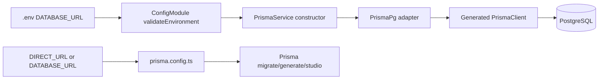
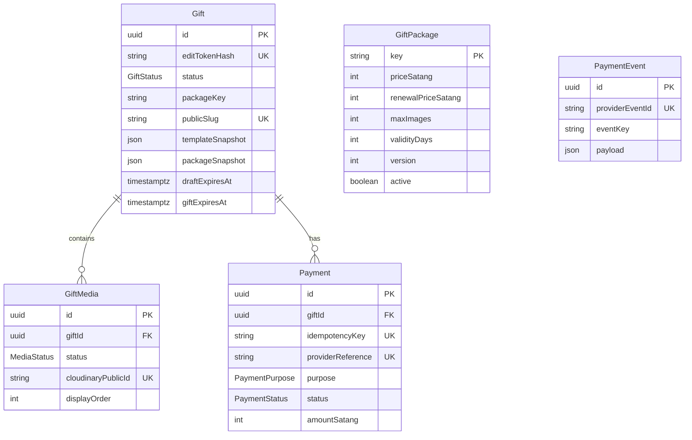

# Database and Prisma

## Connection Flow

Runtime API อ่าน `DATABASE_URL` ผ่าน `ConfigService` ที่ `apps/api/src/database/prisma.service.ts:8-10`. Prisma CLI อ่าน `DIRECT_URL` ก่อน `DATABASE_URL` และ fallback local URL ใน `apps/api/prisma.config.ts:4-16`. Seed ตั้งใจอ่าน root `.env` โดยตรงที่ `apps/api/prisma/seed.ts:7-15`

## Prisma ในโปรเจกต์นี้

- `schema.prisma` นิยาม database model, enum, relation, index และ mapping ชื่อตาราง
- `prisma generate` สร้าง client ที่ `apps/api/src/generated/prisma` (generated output ไม่ใช่ source ที่แก้มือ)
- `PrismaService` extends client เพื่อให้ Nest inject ได้ทั่วระบบและ disconnect ตอน module destroy
- Services เรียก Prisma โดยตรง ไม่มี repository abstraction เพิ่ม
- Prisma 7 แยก connection URL ไป `prisma.config.ts`; datasource block มีเพียง provider PostgreSQL

## Relationship Diagram

`Gift.packageKey` ไม่ได้ประกาศ Prisma relation ไป `GiftPackage`; เป็น string lookup ที่ service ตรวจเอง จึงไม่มี foreign key บังคับ package row ทาง DB

## Models / Tables

### `Gift` → table `gifts`

หนึ่ง row คือ draft หรือ published gift

- identity/security: `id`, `editTokenHash`
- builder: occasion/template/package/title/message/date/finale
- immutable-at-purchase snapshots: template/package JSON
- lifecycle: status, draft/published/gift expiry, public slug
- cleanup retry: attempts/error/next attempt
- relations: media/payments; cascade children เมื่อ Gift ถูกลบ

ใช้โดย create/read/update/publish/public/renewal/cleanup แทบทุก flow

### `GiftMedia` → `gift_media`

หนึ่ง row คือ reservation หรือรูปที่ยืนยันแล้ว

- ก่อน upload: filename/MIME/bytes/public ID/order/reservation expiry, status RESERVED
- หลัง confirm: asset ID/format/actual bytes/dimensions, status READY
- `giftId` FK → Gift `onDelete: Cascade`
- index order และ reservation cleanup

### `Payment` → `payments`

เก็บ purchase/renewal ของ gift

- provider/purpose/status/package/amount/currency
- unique `idempotencyKey` กัน browser retry สร้างซ้ำ
- unique `providerReference` map Opn charge → payment
- QR/failure/completion timestamps
- `giftId` FK cascade

### `PaymentEvent` → `payment_events`

audit/idempotency ของ Opn webhook; `providerEventId` unique. ไม่มี FK ไป Payment เพราะ event ก่อนจับคู่ charge ได้และ payload ถูกเก็บ raw JSON

### `GiftPackage` → `packages`

catalog ฝั่ง server ที่ seed จาก shared `packageCatalog`. Checkout, media limit, renewal และ validity อ่าน row นี้ภายใน flow จริง ไม่เชื่อราคาจาก browser

## Query Map ตาม Feature

| Feature | Prisma calls สำคัญ | Tables read/write |
|---|---|---|
| Create draft | `gift.create(include media)` | W gifts |
| Resume | `gift.findUnique(include media orderBy)` | R gifts, gift_media |
| Update/package change | transaction: `gift.findUnique`, `giftPackage.findUnique`, `gift.update` | R/W gifts; R media/packages |
| Reserve upload | `gift.findUnique`, `giftPackage.findUnique`, `giftMedia.count/aggregate/create` | R gifts/packages/media; W media |
| Confirm | read gift+media, `giftMedia.update` | R/W media |
| Delete/reorder | `giftMedia.deleteMany/findMany/update` | R/W media |
| Checkout | `payment.findUnique/create/update`, `gift.update`, package lookup | R/W payments/gifts; R packages/media |
| Webhook | `paymentEvent.create`, payment lookup/update, gift update | W events; R/W payments/gifts/packages |
| Public gift | `gift.findFirst(include READY media)` | R gifts/media |
| Renewal | gift/payment/package reads + payment/gift updates | R/W gifts/payments; R packages |
| Cleanup | find expired; update/delete Gift/Media | R/W gifts/media; cascade payments |

## Migration

Migration คือ SQL version ของ schema ที่ใช้ทำ DB จริงให้ตรง source. Initial migration อยู่ `apps/api/prisma/migrations/20260820031500_init/migration.sql` และสร้าง enums, 5 tables, unique/indexes/FKs. `npm run db:migrate` เรียก `prisma migrate dev`

หากแก้ `schema.prisma` โดยไม่สร้าง/apply migration database จะยังไม่เปลี่ยนตาม TypeScript

## Seed

`apps/api/prisma/seed.ts::main()` loop `packageCatalog` แล้ว `giftPackage.upsert()` ตาม key:

- มี row แล้ว → update ราคา/limits/version/active
- ไม่มี → create
- เป็น idempotent ในระดับ package key

Seed ต้องมี `DATABASE_URL`; `DIRECT_URL` ไม่ถูกอ่านใน seed script

## Transactions และ Locks

### Transaction

ทำให้หลาย write สำเร็จหรือ rollback เป็นชุด เช่น create payment + set gift PAYMENT_PENDING. `reserveMedia` และ `updateDraft` ใช้ isolation `Serializable`

### Transaction-scoped advisory lock

`SELECT pg_advisory_xact_lock(hashtext(giftId))` serialize งานของ gift เดียวกัน เช่น reserve พร้อมกัน, package downgrade, payment complete. Lock ปล่อยเมื่อ transaction จบ

### Session advisory lock สำหรับ cron

`LifecycleService.withLock()` ใช้ `pg_try_advisory_lock(key)` บน dedicated `pg` connection; replica ที่ไม่ได้ lock จะ return. `finally` unlock และ release connection

## Snapshot Behavior

- Purchase success อ่าน template catalog และ package row แล้วเขียน `templateSnapshot`/`packageSnapshot`
- Public gift parse/read `templateSnapshot` จึงไม่เปลี่ยนสีตาม catalog รุ่นใหม่
- `packageSnapshot` ถูกเขียนแต่ application runtime ปัจจุบันไม่พบจุดอ่าน; renewal กลับไปอ่าน package row ปัจจุบัน

## Deletion Semantics

DB cascade ลบ `gift_media`/`payments` เมื่อ `gifts` ถูกลบ แต่ Cloudinary อยู่นอก transaction จึงต้องลบ external assets ก่อน. หาก Cloudinary ล้มเหลว gift อยู่ `DELETION_PENDING` พร้อม exponential-ish retry 15–360 นาที

## Important Indexes

- gift status + draft/gift expiry สำหรับ cron
- status + next cleanup attempt สำหรับ retry
- media gift+order และ reservation expiry
- payment gift+created, provider+status+created
- unique token hash, public slug, Cloudinary IDs, idempotency key, provider reference/event ID
