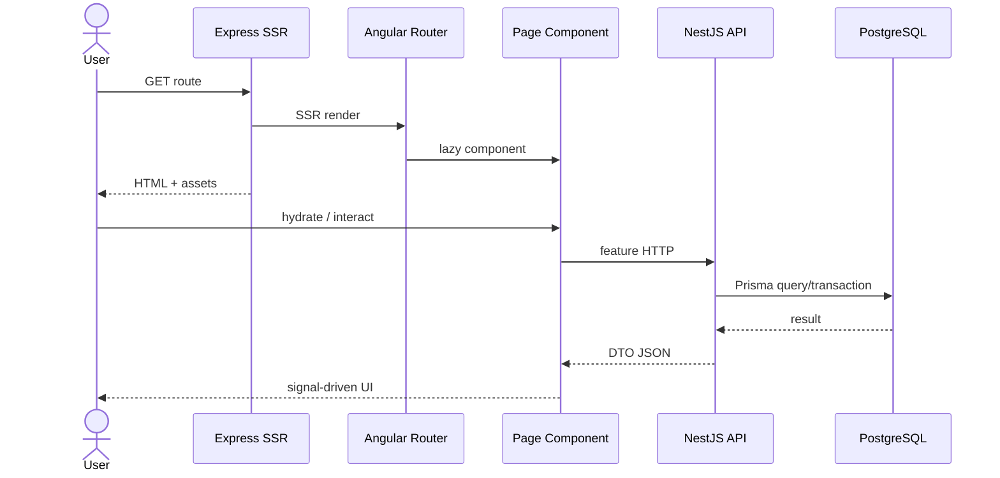
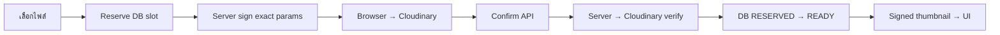
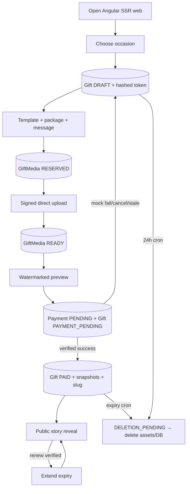

# End-to-End System Flow

เอกสารนี้เล่าโปรแกรมตั้งแต่เปิดเว็บจน giftหมดอายุ โดยเชื่อม frontend, backend, database และ providersเป็นเรื่องเดียว

## 1. ผู้ใช้เปิดเว็บ

Production SSR requestเข้า Express ที่ `apps/web/src/server.ts`. Serverใส่ CSP/security headers, เสิร์ฟ static fileถ้าตรง มิฉะนั้นส่ง requestให้ `AngularNodeAppEngine.handle()`. `main.server.ts` bootstrap `App` พร้อม server rendering; route `**` เป็น `RenderMode.Server`

HTMLมี `<app-root>` → `App`มี `<router-outlet>` → Router lazy-load component. Browserโหลด bundleแล้ว `main.ts` bootstrapด้วย HttpClient/Router/hydration



## 2. สร้างตัวตนแบบ Guest

หน้า `/` ไม่มี login. ผู้ใช้เลือก occasion; browser POST `/drafts`. Backendสุ่ม secret 256-bit ส่ง plaintextกลับครั้งเดียว แต่ DBเก็บ SHA-256. Frontendเก็บ tokenใน localStorageที่ผูก gift UUIDแล้วเปลี่ยน URLเป็น `/builder/:id`

จากนี้ protected requestมีสองชิ้น:

- path ID บอกว่าจะทำกับ giftไหน
- bearer edit tokenพิสูจน์สิทธิ์; IDอย่างเดียวไม่พอ

Serverส่ง `serverNow` + `draftExpiresAt`; browserคำนวณ clock offsetและอัปเดต countdownทุกวินาที. DB timestampเป็น UTC

## 3. ออกแบบ Gift

ผู้ใช้เลือก templateจาก catalogที่ filterตาม occasionและ packageจาก shared catalog. ทุก click PATCH backend; serverไม่เชื่อ catalog client:

- template lookupใน server contracts
- package lookup rowใน PostgreSQL
- package changeอยู่ transactionและ lockเดียวกับ media reserve

ข้อความแก้ใน local signalก่อน; submitแล้ว PATCH. UI wizard guardsช่วยนำทาง แต่ APIตรวจ stateทุกครั้ง

## 4. อัปโหลดรูปโดยไม่ส่ง binaryผ่าน API

Browserตรวจ MIME/size/countเพื่อ UX แล้วขอ reservation. Backend lock gift, ตรวจ token/DRAFT/expiry/package/count และสร้าง RESERVED row 10 นาที จากนั้น CloudinaryService sign paramsด้วย secret

Browserส่ง binary + exact paramsไป Cloudinaryโดยตรง. เมื่อ providerตอบ success browserเรียก confirm. Backendใช้ Admin API query assetจาก server-owned public ID, ตรวจ metadataจริง แล้ว mark READY. Draft responseใช้ signed thumbnail URL



Drag/dropและปุ่ม keyboardส่ง UUIDทั้งหมดตาม order. Backendยืนยันว่า setตรงกับ READY mediaทุกใบก่อน update. Deleteลบ providerก่อน DBและ compact order

## 5. Preview

UI compositionมาจาก draft fields + template tokens + READY thumbnails. CSS pseudo-elementวาง “APORAVIZ GIFT · PREVIEW” เหนือ composition; ต้นฉบับ Cloudinaryไม่ถูก bake watermark. Previewไม่ใช่ public routeและ public APIยังไม่คืน DRAFT

## 6. Checkout

Browserสร้าง idempotency UUIDต่อ actionและส่ง header. Backend transactionตรวจ token, state, expiry, template, packageและอย่างน้อยหนึ่ง READY image; priceอ่าน `packages` row. จากนั้นสร้าง Payment PENDINGและเปลี่ยน Gift PAYMENT_PENDINGพร้อมกัน

### Mock

failureเปลี่ยน Payment FAILED/Gift DRAFTและคืน DTOให้ UI. successเรียก `completePayment()`ทันที

### Opn

Backendสร้าง PromptPay source/chargeด้วย test keys,เก็บ charge ID/QRและคืน PENDING. Browserแสดง QRและ poll GET paymentทุก 3 วินาที แต่ pollingไม่ publish

Opnส่ง signed webhook; backendตรวจ HMAC/raw body/timestamp,บันทึก unique event, query authoritative charge แล้วตรวจ amount/currency/metadata/state. ผ่านเท่านั้นจึง `completePayment()`. Cron reconciliationเป็น fallbackเมื่อ webhookหาย

Cancelหรือ stale 30 นาที mark FAILED; purchase giftกลับ DRAFT. Advisory lockป้องกัน cancel/webhook/cron completeชนกัน

## 7. Publish Transaction

`completePayment()` lock giftและ re-read state. Purchase success:

1. Gift PAYMENT_PENDING → PAID
2. set publishedAt
3. expiry = now + package validity
4. generate random public slug
5. snapshot template catalog + package DB row
6. Payment PENDING → SUCCEEDED

ทุกอย่างอยู่ transactionเดียว. Responseมี slug/expiry; Builderสร้าง URLจาก current origin,เก็บ renewal tokenและแสดง success state

## 8. ผู้รับเปิด Public Gift

Route `/gifts/:slug` GET public APIโดยไม่ต้อง token. Queryบังคับ slugตรง + PAID + expiryอนาคต; READY mediaเรียง order. Templateมาจาก snapshot. APIสร้าง signed display URLต่อภาพและไม่คืน internal IDsอื่นนอกจาก media ID

Public UI:

```text
loading
→ envelope
→ click: opened=true
→ intro title/message/date
→ click: revealed=1..N แสดงรูปทีละใบ
→ clickหลังรูปสุดท้าย: revealed=N+1
→ finale
→ replay reset local state
```

Reveal/replayไม่เขียน DB; เป็น presentation stateใน browser

## 9. Renewal

อุปกรณ์ผู้สร้างเดิมมี renewal tokenจึงเห็นปุ่มที่ finale. Backend auth tokenและบังคับ giftยัง PAID/unexpired. Renewal Paymentใช้ current renewal price/package validity

- mock successขยายทันที
- Opnใช้ QR/webhook/pollแบบ purchase
- expiryใหม่ต่อจาก expiryเดิม ไม่ใช่จากเวลาปัจจุบัน
- renewalไม่สร้าง slugใหม่และไม่ snapshot templateใหม่

## 10. Time-based Lifecycle

ScheduleModuleเรียก LifecycleService:

- expired reservationทุก 15 นาที
- expired draftทุก 15 นาที
- stale paymentทุก 5 นาที
- Opn reconcileทุก 10 นาทีเมื่อ configเปิด
- expired paid giftทุกวัน 02:00 Bangkok

Cronแต่ละกลุ่มลอง PostgreSQL advisory lock; replicaที่แพ้ไม่ทำงาน. Gift cleanup set DELETION_PENDINGก่อนลบ Cloudinary. Successลบ Giftและ DB cascade media/payments; failureเก็บ error/attempt/retry time

## Full Main Business Flow



## Main Flows ที่พบ

- create/resume/edit guest draft
- template/package selectionและ downgrade protection
- signed upload reservation/confirm/reorder/delete
- message/date/preview watermark
- mock purchase success/failure/retry
- Opn PromptPay pending/poll/cancel/webhook/reconcile
- publish/share/public story reveal/replay
- mock/Opn renewal
- draft/media/payment/gift expiryและ retryable cleanup

ไม่มี login/search/admin flow

## Start Here — ลำดับอ่านเอกสาร

1. [SYSTEM_OVERVIEW.md](./SYSTEM_OVERVIEW.md) — เห็นกล่องทั้งระบบ
2. [SCREEN_AND_ROUTE_FLOW.md](./SCREEN_AND_ROUTE_FLOW.md) — รู้หน้ากับ journey
3. [END_TO_END_SYSTEM_FLOW.md](./END_TO_END_SYSTEM_FLOW.md) — อ่านเรื่องราวเต็มหนึ่งรอบ
4. [CODE_MAP.md](./CODE_MAP.md) — เลือกไฟล์ sourceที่จะเปิด
5. [FRONTEND_FLOW.md](./FRONTEND_FLOW.md) — ตาม event/state/HTTP
6. [BACKEND_FLOW.md](./BACKEND_FLOW.md) — ตาม controller/service/pipeline
7. [DATABASE_AND_PRISMA.md](./DATABASE_AND_PRISMA.md) — ตาม persistence/relation
8. [REQUEST_LIFECYCLE.md](./REQUEST_LIFECYCLE.md) — เจาะ requestทีละชั้น
9. [SIGNATURE_AND_UPLOAD_FLOW.md](./SIGNATURE_AND_UPLOAD_FLOW.md) — เจาะ trust boundary upload/webhook
10. [AUTHENTICATION_AND_SECURITY.md](./AUTHENTICATION_AND_SECURITY.md) — token/permission/security
11. [FEATURE_FLOWS.md](./FEATURE_FLOWS.md) — เปิดตาม business feature
12. [ERROR_HANDLING_FLOW.md](./ERROR_HANDLING_FLOW.md) — ตาม failure path
13. [CONFIG_AND_ENVIRONMENT.md](./CONFIG_AND_ENVIRONMENT.md) — ตั้งค่า/secret/production gaps
14. [IMPORTANT_TECHNICAL_CONCEPTS.md](./IMPORTANT_TECHNICAL_CONCEPTS.md) — ทบทวนแนวคิด
15. [UNKNOWN_OR_UNUSED_CODE.md](./UNKNOWN_OR_UNUSED_CODE.md) — auditสิ่งที่ค้าง/ไม่ใช้/ไม่ชัด

## เอกสารไหนใช้เมื่อไร

| ต้องการเข้าใจ | เปิดไฟล์ |
|---|---|
| Architecture/technology/external services | SYSTEM_OVERVIEW |
| หน้า ปุ่ม route navigation | SCREEN_AND_ROUTE_FLOW |
| Angular state/event/service | FRONTEND_FLOW |
| Nest module/controller/validation/service | BACKEND_FLOW |
| Tables/relations/queries/migration/seed | DATABASE_AND_PRISMA |
| token/permission/signature/security | AUTHENTICATION_AND_SECURITY |
| upload signatureแบบละเอียด | SIGNATURE_AND_UPLOAD_FLOW |
| env/CORS/CSP/secret | CONFIG_AND_ENVIRONMENT |
| business flowราย feature | FEATURE_FLOWS |
| validation/provider/DB/UI errors | ERROR_HANDLING_FLOW |
| ศัพท์และ pattern | IMPORTANT_TECHNICAL_CONCEPTS |
| source entry points | CODE_MAP |
| request shapeทุก layer | REQUEST_LIFECYCLE |
| dead/partial/unclear code | UNKNOWN_OR_UNUSED_CODE |
| อ่านระบบเป็นเรื่องเดียว | END_TO_END_SYSTEM_FLOW |
