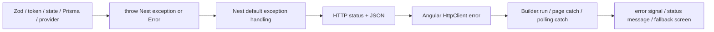

# Error Handling Flow

## ภาพรวม



ไม่มี custom exception filter/interceptor ดังนั้น Nest built-in exceptionsรักษา status ที่ระบุ ส่วน raw `Error` และ Prisma/provider errorsที่ไม่ได้แปลงมักจบเป็น 500

## Backend Error Sources

| Error type | สร้างที่ไหน | Exception / status | Body/ผล |
|---|---|---|---|
| Body validation | `ZodValidationPipe.transform()` | `BadRequestException` 400 | message Validation failed + issues path/message |
| Path UUID invalid | built-in `ParseUUIDPipe` ใน controllers | 400 | Nest standard bad request |
| Missing token | `GiftsService.assertToken()` | `UnauthorizedException` 401 | Missing edit token |
| Invalid token | methodเดียวกัน | `ForbiddenException` 403 | Invalid edit token |
| Mock disabled | `PaymentsService` | 403 | Mock payment is disabled |
| Missing gift/media/payment | Gifts/Payments services | `NotFoundException` 404 | entity-specific message |
| Wrong lifecycle/expired/limit/order/idempotency collision | services | `ConflictException` 409 | business message |
| Bad template/package/file/checkout prerequisites | services | `BadRequestException` 400 | business message |
| Cloudinary config missing | `CloudinaryService.assertConfigured()` | 503 | credentials not configured |
| Public signed URL unavailable | `GiftsService.getPublicGift()` | 503 | media temporarily unavailable |
| Opn keys not test | `OpnService.assertTestMode()` | 503 | only test keys allowed |
| Opn HTTP non-2xx | `OpnService.post/getCharge()` | `BadGatewayException` 502 | provider status/details (POST details capped 300 chars) |
| Webhook missing/invalid signature | `verifyWebhook()` | 403 | signature message |
| Webhook stale timestamp | `verifyWebhook()` | 403 | outside replay window |
| Webhook secret missing | `verifyWebhook()` | 503 | secret not configured |
| Webhook malformed JSON/event | `handleOpnWebhook()` | 400 | invalid event JSON/event |
| Rate limit | global/route `ThrottlerGuard` | 429 | Nest throttler response |
| DB unavailable/unmapped Prisma error | Prisma call | usually 500 | Nest generic internal error |

## Frontend Error Handling

### Builder normal actions

`BuilderPage.run(work)` (`builder.page.ts:332-343`):

1. set busy=true, clear old error
2. await full async flow
3. catch: อ่าน `(error.error.message)` จาก Angular HTTP error
4. message array → join; string → show; ไม่มี → “เกิดข้อผิดพลาด...”
5. finally busy=false

UI แสดง `error()` ใน `<div role="alert">`. ปัญหา: Zod responseใช้ `message='Validation failed'` และรายละเอียดอยู่ `issues`; `run()` ไม่อ่าน issues จึงผู้ใช้เห็นเพียงข้อความรวม

### Client validation

`uploadFiles()` set errorแล้ว return ก่อน `run()` สำหรับ type/size/count. `go()` set errorและย้ายกลับ step ที่แก้ได้สำหรับ missing design/media

### Payment polling

- GET status fail: ไม่ throwออก UI หลัก, set “ตรวจสถานะไม่สำเร็จชั่วคราว” แล้ว intervalลองใหม่
- timeout: หยุด poll, call cancel; success/failของ cancelแสดงข้อความเหมาะสม
- component destroy: clear interval/timeout

### Public page

`PublicGiftPage.ngOnInit()` catch ทุก errorเป็นข้อความเดียว “ไม่พบของขวัญ หรือลิงก์นี้หมดอายุแล้ว”. ผู้ใช้แยก 404, network, 503 Cloudinaryไม่ได้จาก UI

### Renewal

- create fail → “ต่ออายุไม่สำเร็จ...”
- cancel fail → “ยกเลิกรายการไม่สำเร็จ...”
- poll fail → “ตรวจสถานะ...ชั่วคราว” และ retry
- Payment FAILED → ใช้ `failureReason` จาก API

## Detailed Error Flows

### Validation fail

```text
invalid body
→ Controller parameter invokes ZodValidationPipe
→ schema.safeParse fails
→ throw BadRequestException({message,issues})
→ Nest 400 JSON
→ HttpClient errors
→ Builder.run catch
→ alert “Validation failed”
```

### Authentication fail

```text
no/invalid local token
→ no token: Builder direct-route check stops locally
or request Authorization header
→ bearerToken()
→ GiftsService.assertToken()
→ 401 missing / 403 invalid
→ component alert
```

### Upload signature/direct upload fail

- API signature config fail: reservation rowถูกลบใน `reserveMedia()` catch
- Cloudinary rejects form: frontend stops before confirm; RESERVED rowคงจน cron
- confirm sees oversized/disallowed asset: backendพยายาม delete Cloudinaryแล้ว 400; rowคง RESERVEDจน cron
- provider Admin API errorไม่ได้แปลงเฉพาะ → Nest/provider error response; UI generic/API message

### Database error

Prisma transaction rollbackป้องกัน partial DB write แต่ external operationsไม่ rollback เช่น Cloudinary uploadสำเร็จแล้ว confirm DB fail. Reservation cleanupเป็น eventual recovery. Sourceไม่มี custom Prisma exception mapper จึง unique race/connectivity errorsบางชนิดเป็น 500

### Mock payment failure

Payment PENDING ถูก transaction update FAILED + Giftกลับ DRAFT; responseเป็น 201 `PaymentDto` status FAILED ไม่ใช่ HTTP error. `handlePayment()` แสดง `failureReason` และเปิดให้ retry

### Opn checkout failก่อนได้ charge

catch ใน `opnCheckout()` update Payment FAILED + Gift DRAFT แล้ว rethrow provider error → browserเห็น HTTP 502/503; DBไม่ค้าง PAYMENT_PENDING

### Webhook mismatch

Signatureผ่าน → eventถูกบันทึก → fetch charge → หากหา paymentไม่พบหรือ amount/currency/metadata/stateไม่ตรง `completeVerifiedCharge()` return false → log warn → ตอบ accepted. จุดประสงค์คือไม่ให้ Opn retryไม่จบกับ eventที่ระบบตั้งใจ ignore

### Cleanup fail

`deleteGift()` set DELETION_PENDINGก่อนลบ asset. catchแล้วอ่าน attempt, เก็บ errorสูงสุด 2,000 chars และ retryเวลา `min(attempt*15,360)` นาที. Cronรอบถัดไปอ่าน `nextCleanupAttemptAt`

### Reservation cleanup subtlety

`cleanExpiredReservations()` catch/log Cloudinary delete errorแล้วลบ DB reservationต่อ; ถ้าลบ external fail อาจเหลือ orphan assetโดยไม่มี DB pointer. นี่เป็น behaviorจริง ไม่ใช่ retryable DELETION_PENDING flowของทั้ง gift

## Errors ที่ไม่มี handling เฉพาะ

- clipboard write failใน `copyLink()` ไม่มี try/catch
- `BuilderPage.ngOnInit()` เรียก `loadDraft()` นอก `run()`; HTTP errorอาจไหลถึง Angular global error listenerแทน error signal
- renewal pending stateไม่ resumeหลัง refresh
- SSR engine errorsส่ง Express `next(error)`; final Express error behaviorมาจาก framework ไม่มี custom handler
