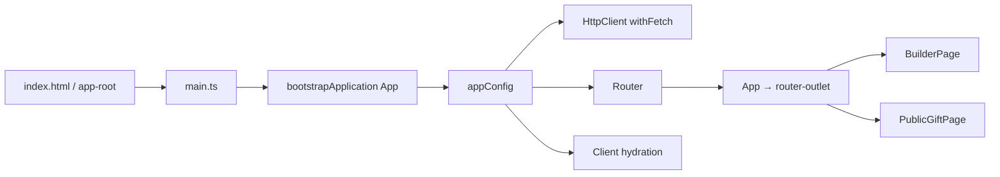

# Frontend Flow

## Bootstrap: Browser และ SSR



- Browser entry: `apps/web/src/main.ts:1-6`
- Server entry: `apps/web/src/main.server.ts:1-8`
- Root component: `apps/web/src/app/app.ts` + `app.html`
- DI providers: `app.config.ts:7-14`
- SSR config: `app.config.server.ts` รวม browser config กับ `provideServerRendering(withRoutes(serverRoutes))`
- Express SSR: `server.ts::angularApp.handle(req)`

## Route → Component

```text
/
→ lazy import('./builder.page')
→ BuilderPage

/builder/:id
→ BuilderPage.ngOnInit()
→ localStorage edit token
→ GiftApiService.getDraft()
→ GET /v1/drafts/:id

/gifts/:slug
→ PublicGiftPage.ngOnInit()
→ GiftApiService.getPublicGift()
→ GET /v1/gifts/:slug
```

## Builder State

`BuilderPage` ใช้ Angular signals แทน global store

| State | ชนิด | ใครแก้ | UI ที่อ่าน |
|---|---|---|---|
| `step` | `signal<Step>` | `chooseOccasion`, `go`, `saveMessage`, `handlePayment` | `@if` เลือก wizard screen |
| `draft` | `signal<DraftDto|null>` | create/load/patch/reorder/payment failure | form, template, media, preview |
| `editToken` | `signal<string>` | create/resume | ทุก protected request |
| `busy`, `error` | signals | `run()` | disable buttons / alert |
| `secondsRemaining` | signal | `startCountdown()` ทุก 1 วินาที | header countdown |
| `payment` | `signal<PaymentDto|null>` | `handlePayment()` | QR/pending/cancel buttons |
| `publicUrl` | signal | payment success | success screen |
| `selectedTemplate`, `visibleTemplates`, `selectedPackage`, `readyMedia`, `canPay`, `paymentBlockReason` | `computed` | derive จาก draft/catalog | guards + rendering |

Signals เป็น state synchronous; HTTP ของ `HttpClient` คืน RxJS `Observable` แล้ว component ใช้ `firstValueFrom()` แปลงเป็น `Promise` เพื่อเขียน flow แบบ `async/await`. ไม่มี manual `subscribe()` ใน application code จึงไม่มี subscription ที่ต้อง unsubscribe; timers ถูก clear ใน `ngOnDestroy()`

## Event → Method → Service → HTTP

| Route/step | DOM Event | Component method | Service method | Request / ผลต่อ state |
|---|---|---|---|---|
| `/` occasion | click occasion | `chooseOccasion()` | `createDraft()` | `POST /drafts`; เก็บ token, navigate, step=design |
| design | click template | `chooseTemplate()` → private `patch()` | `updateDraft()` | `PATCH /drafts/:id`; replace `draft` |
| design | click package | `choosePackage()` → `patch()` | `updateDraft()` | PATCH; replace `draft` |
| wizard nav | click | `go()` | ไม่มีทันที | client guard แล้วเปลี่ยน `step` |
| photos | file change | `uploadFiles()` | `reserveMedia()` → `uploadToCloudinary()` → `confirmMedia()` → `getDraft()` | 3 HTTP hops ต่อไฟล์ + reload draft |
| photos | CDK drop | `drop()` → `persistOrder()` | `reorderMedia()` | `PUT /media-order`; replace draft |
| photos | arrow click | `moveMedia()` → `persistOrder()` | `reorderMedia()` | เหมือน drag-drop |
| photos | delete | `removeMedia()` | `deleteMedia()` → `getDraft()` | DELETE แล้ว reload |
| message | input | `updateField()` | ไม่มี | optimistic local draft update |
| message | submit | `saveMessage()` → `patch()` | `updateDraft()` | PATCH แล้ว step=preview |
| preview | mock buttons | `checkout()` | `mockCheckout()` | POST; `handlePayment()` |
| preview | PromptPay | `checkout('opn')` | `opnCheckout()` | POST; pending → QR + polling |
| preview | cancel | `cancelPendingPayment()` | `cancelPayment()` | POST; failed → draft local status DRAFT |
| success | copy | `copyLink()` | ไม่มี | `navigator.clipboard.writeText()` |
| public | init | `ngOnInit()` | `getPublicGift()` | GET; set gift/loading/error |
| public story | click | `revealNext()` | ไม่มี | opened/revealed signals |
| public finale | replay | `replay()` | ไม่มี | reset opened/revealed |
| public finale | renew | `renew()` | `renewGift()` | POST; success update expiry, pending poll |
| public finale | cancel renewal | `cancelRenewal()` | `cancelPayment()` | POST; update message/payment |

## `GiftApiService`

ไฟล์ `apps/web/src/app/gift-api.service.ts`, class `GiftApiService`, `providedIn: 'root'`

| Method | Parameters | Return (Observable) | HTTP |
|---|---|---|---|
| `createDraft(occasionKey)` | union 3 occasions | `Observable<CreateDraftResponse>` | POST `/drafts` |
| `getDraft(id, token)` | UUID + token | `Observable<DraftDto>` | GET `/drafts/:id` |
| `updateDraft(id, token, changes)` | selected editable fields | `Observable<DraftDto>` | PATCH `/drafts/:id` |
| `reserveMedia(id, token, file)` | clientส่ง filename/type/size | `Observable<MediaReservation>` | POST `/media-reservations` |
| `uploadToCloudinary(reservation, file)` | signed params + binary | `Observable<unknown>` | POST URL จาก reservation |
| `confirmMedia(id, mediaId, token)` | IDs/token | `Observable<unknown>` | POST `/confirm` |
| `deleteMedia(...)` | IDs/token | `Observable<void>` | DELETE media |
| `reorderMedia(...)` | ordered UUID array | `Observable<DraftDto>` | PUT media-order |
| `mockCheckout(...)` | outcome + UUID idempotency key | `Observable<PaymentDto>` | POST mock checkout |
| `opnCheckout(...)` | idempotency key | `Observable<PaymentDto>` | POST Opn checkout |
| `getPayment(...)` | payment UUID/token | `Observable<PaymentDto>` | GET payment |
| `cancelPayment(...)` | payment UUID/token | `Observable<PaymentDto>` | POST cancel |
| `getPublicGift(slug)` | encoded slug | `Observable<PublicGiftDto>` | GET public gift |
| `renewGift(...)` | slug/token/key/provider | `Observable<PaymentDto>` | POST renewal |

`auth()` สร้าง `Authorization: Bearer <token>` และเพิ่ม `Idempotency-Key` เมื่อมี ไม่มี HTTP interceptor; ทุก method protected ต้องเรียก helper เอง

## Payment Polling

### Purchase

- `handlePayment(PENDING)` เก็บ payment ID ที่ `aporaviz-gift:pending-payment:<giftId>` และเรียก `startPaymentPolling()`
- interval ทุก 3 วินาทีเรียก `pollPayment()` → `getPayment()`
- flag `paymentPollInFlight` กัน request ซ้อน
- timeout 30 นาทีเรียก `timeoutPayment()` → cancel endpoint
- success: clear timers/storage, เก็บ renewal token, สร้าง URL จาก `location.origin`, step=success
- destroy component: `stopPaymentPolling()`

### Renewal

`PublicGiftPage` ใช้ patternเดียวกันใน `startRenewalPolling()`/`pollRenewal()`/`stopRenewalPolling()` แต่ไม่ persist pending renewal ID; refresh ระหว่าง pending แล้ว UI ไม่มี logic resume รายการเดิม

## Browser Storage

| Key | Value | เขียน/อ่าน |
|---|---|---|
| `aporaviz-gift:edit-token:<giftId>` | opaque edit token | Builder create/resume |
| `aporaviz-gift:pending-payment:<giftId>` | payment UUID | purchase pending/resume |
| `aporaviz-gift:renew-token:<slug>` | edit token เดิม | purchase success/public renewal |

ไม่มี cookie/sessionStorage. Token ไม่อยู่ URL แต่ XSS ที่ทำงานใน origin เดียวกันสามารถอ่าน localStorage ได้ จึงต้องรักษา CSP และหลีกเลี่ยง unsafe HTML

## Guard / Resolver / Interceptor / Config

- Angular route guard: ไม่มี
- Resolver: ไม่มี
- HTTP interceptor: ไม่มี
- Global error handler: ใช้ `provideBrowserGlobalErrorListeners()`; feature errorsส่วนใหญ่ถูก component catch เอง
- Environment: development file ชี้ `http://localhost:3000/v1`; production fileชี้ relative `/api/v1`; replacement อยู่ใน `angular.json:60-65`
- SSR browser API guard: `isPlatformBrowser()` ครอบ `localStorage`, `location`, `navigator.clipboard` และ browser-only flows

## Frontend Error Surface

- Builder network/API errorsผ่าน `run()` แล้วอ่านข้อความ `error.message` หรือ fallback ไทยไป `error` signal
- file type/size/count ถูก reject ก่อน HTTP
- payment polling error ไม่หยุด interval แต่เปลี่ยน status message
- Public gift init catch รวม 404/expired/network/provider เป็นข้อความเดียว
- renewal มีข้อความแยก create/cancel/poll

รายละเอียด status และ backend origin อ่าน [ERROR_HANDLING_FLOW.md](./ERROR_HANDLING_FLOW.md)
