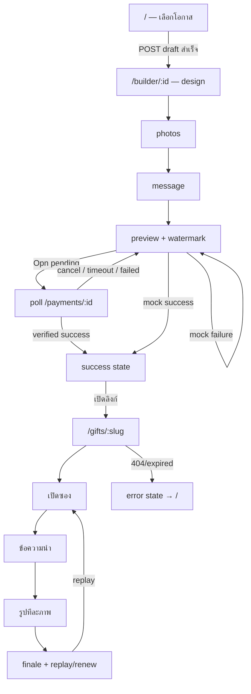

# Screen and Route Flow

## Route Inventory

Route table มาจาก `apps/web/src/app/app.routes.ts:3-8`; ทุก route SSR ด้วย `apps/web/src/app/app.routes.server.ts:3-7`

| หน้า | URL | Component / file | หน้าที่และ Action สำคัญ | สิทธิ์ | API ที่เรียก | ไปต่อ |
|---|---|---|---|---|---|---|
| เริ่มสร้างของขวัญ | `/` | `BuilderPage` — `apps/web/src/app/builder.page.ts` | เลือกวันเกิด/ครบรอบ/แต่งงาน; ปุ่มเรียก `chooseOccasion()` | ไม่ต้อง login/token | `POST /v1/drafts` | navigate แบบ replace ไป `/builder/:id` |
| Builder / Resume | `/builder/:id` | `BuilderPage` ไฟล์เดียวกัน | เลือก template/package, upload, reorder, delete, เขียนข้อความ, preview, mock/Opn checkout, cancel, copy link | ต้องมี edit token ของ ID นี้ใน `localStorage`; ไม่มี route guard แต่ API ตรวจ token | draft/media/payment endpoints หลายตัว | internal step ถัดไป; เมื่อสำเร็จยังอยู่ route เดิม; link ไป `/gifts/:slug` |
| Public Gift | `/gifts/:slug` | `PublicGiftPage` — `apps/web/src/app/public-gift.page.ts` | เปิดซอง, แตะ reveal รูป, finale, replay; เจ้าของอุปกรณ์เดิมต่ออายุ mock/Opn/cancel ได้ | การรับชมไม่ต้อง token; renewal ต้อง renewal token ใน `localStorage` | `GET /v1/gifts/:slug`; renewal/payment endpoints | replay หน้าเดิม; error link กลับ `/` |
| Fallback | route อื่นทั้งหมด | redirect rule | redirect ไปหน้าเริ่มต้น | ไม่มี | ไม่มี | `/` |

ไม่มี `Login`, `Dashboard`, `Create Gift` route แยก, success route หรือ expired route ใน implementation ปัจจุบัน

## Builder เป็นหน้าหนึ่งแต่มี 6 Screen States

ตัวแปร `BuilderPage.step: signal<Step>` ที่ `builder.page.ts:48` ควบคุม block `@if` ใน template

| Step | UI / ผู้ใช้ทำอะไร | Event → Method | เงื่อนไขไปต่อ |
|---|---|---|---|
| `occasion` | Landing + เลือกโอกาส | `(click)` → `chooseOccasion(occasionKey)` | API สร้าง draft สำเร็จ |
| `design` | เลือก 1 ใน 7 template ตาม occasion และ 1 ใน 2 packages | `chooseTemplate()`, `choosePackage()`, `go('photos')` | ต้องมี `templateKey` และ `packageKey` |
| `photos` | เลือกไฟล์, ดู progress, drag/drop, เลื่อน, ลบ | `uploadFiles()`, `drop()`, `moveMedia()`, `removeMedia()` | ต้องมี media `READY` อย่างน้อย 1 |
| `message` | กรอก title/date/message/finale | `updateField()`, submit → `saveMessage()` | save สำเร็จแล้วไป preview |
| `preview` | composition มี CSS watermark, package summary, mock success/failure หรือ PromptPay | `checkout()`, `cancelPendingPayment()` | `canPay` ต้องเป็น DRAFT + template + package + READY media |
| `success` | แสดง public URL, copy และเปิด gift | `copyLink()` / `<a>` | payment `SUCCEEDED` และมี `publicSlug` |

`success` ไม่ใช่ URL ใหม่ หาก refresh หลังจ่ายสำเร็จ `ngOnInit()` ไม่มี logic reconstruct success screen จาก paid gift จึงกลับมาเริ่มที่ design; public link ยังใช้งานได้แต่ไม่ได้ถูกโหลดกลับมาในหน้านี้

## Navigation Flow

## Route Entry Behavior

### เปิด `/`

1. Router lazy-load `BuilderPage` (`app.routes.ts:4`)
2. `ngOnInit()` อัปเดต SEO แล้วพบว่าไม่มี `id` จึง return (`builder.page.ts:72-78`)
3. ค่าเริ่มต้น `step='occasion'` ทำให้แสดง landing (`builder.page.html:33-50`)

### เปิด `/builder/:id` โดยตรง

1. SSR pass ไม่แตะ `localStorage` เพราะ `browser=false`
2. ฝั่ง browser อ่าน `aporaviz-gift:edit-token:<id>` (`builder.page.ts:77-85`)
3. ไม่มี token: แสดง alert “ไม่พบสิทธิ์...” และไม่ยิง API
4. มี token: `GET /drafts/:id`, เริ่ม countdown, เปิด design
5. ถ้ามี pending payment ID: `GET /payments/:id`; หากยัง pending เริ่ม poll
6. ถ้า DB บอก `PAYMENT_PENDING` แต่ local pending ID หาย: เปิด preview พร้อมข้อความรอคืน draft

ไม่มี Angular `CanActivate` guard; permission enforcement จริงเกิดใน backend service

### เปิด `/gifts/:slug`

1. `PublicGiftPage.ngOnInit()` เรียก public API
2. สำเร็จ: set gift, SEO, ตรวจ renewal token; เริ่มหน้า envelope
3. 404/expired/provider errorใด ๆ: catch แบบรวมและแสดง “ไม่พบของขวัญ หรือลิงก์นี้หมดอายุแล้ว”
4. แตะครั้งแรกเปิด envelope; แตะใน story เพิ่ม `revealed`; เมื่อ `revealed > media.length` แสดง finale

## Login / Permission Matrix

| Capability | Credential | ตรวจที่ไหน |
|---|---|---|
| สร้าง draft | ไม่มี | public endpoint + throttle |
| อ่าน/แก้ draft/media/payment | opaque edit token | `GiftsService.assertToken()` |
| ดู paid gift | public slug | query บังคับ `PAID` และไม่หมดอายุ |
| ต่ออายุ | edit token เดิม | `PaymentsService.renew()` → `assertToken()` |
| Opn webhook | HMAC signature + timestamp | `PaymentsService.verifyWebhook()` |

อ่านรายละเอียดใน [AUTHENTICATION_AND_SECURITY.md](./AUTHENTICATION_AND_SECURITY.md)
