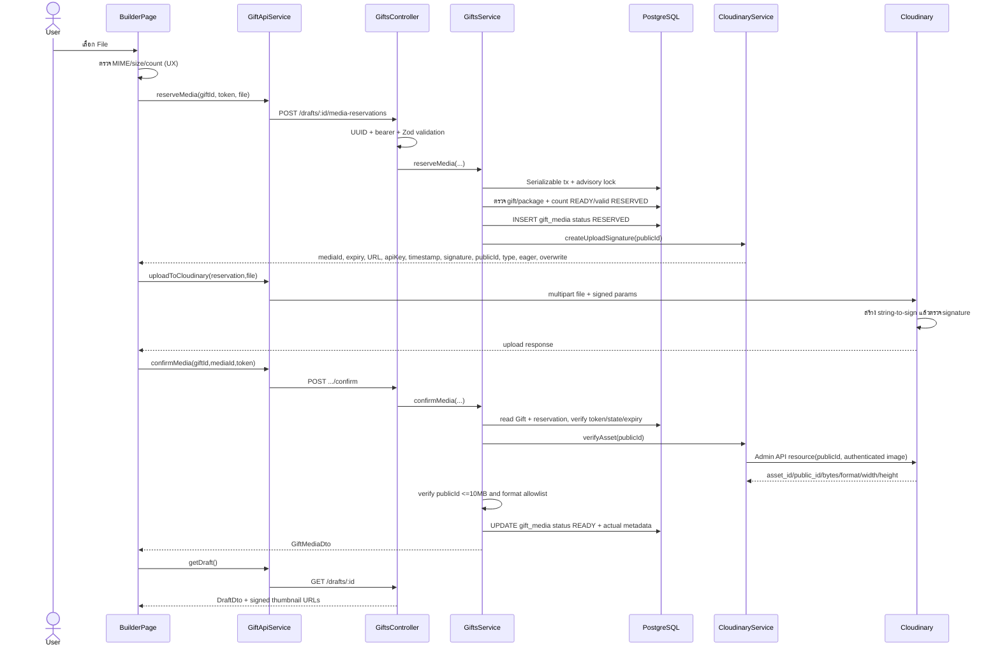
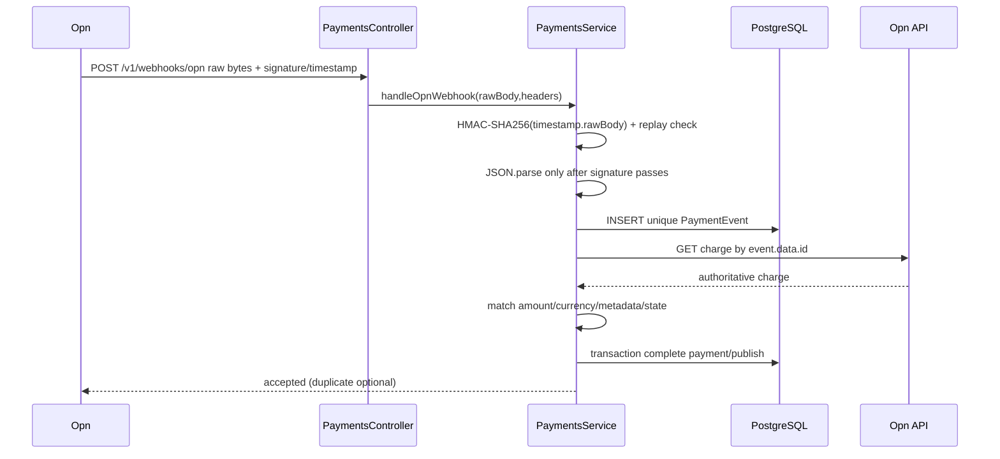

# Signature and Upload Flow

## Signature ในระบบนี้มี 3 ความหมาย

1. **Cloudinary upload signature** — อนุญาต browser upload ด้วย server-owned params โดยไม่เผย API secret
2. **Cloudinary signed delivery URL** — URL ชั่วคราว/เซ็นสำหรับอ่าน authenticated image
3. **Opn webhook HMAC signature** — พิสูจน์ว่า raw webhook body มาจากผู้ถือ webhook secret และยังอยู่ใน replay window

ทั้งสามไม่ใช่ edit token และใช้แทนกันไม่ได้

## Signed Direct Upload: End-to-End



## Step-by-Step แบบ No Black Box

### 1. Browser pre-check

- File/function: `apps/web/src/app/builder.page.ts::uploadFiles()` lines 141–166
- Input: browser `Event` จาก `<input type=file multiple accept=...>`
- ตรวจ: MIME เป็น `image/jpeg|image/png|image/webp`, size ≤ 10MB, total READY + selected files ≤ client catalog limit
- Output: ยังไม่มี networkถ้า fail; set `error` signal
- ทำไมมี: feedbackเร็วและลด upload ที่รู้ว่าจะตก
- ถ้าเอาออก: backendยังป้องกันได้ แต่ผู้ใช้เสียเวลา/request; ห้ามใช้ client check เป็น security boundary

### 2. ขอ reservation

- Caller: `uploadFiles()` → `GiftApiService.reserveMedia()`
- HTTP: `POST /v1/drafts/:giftId/media-reservations`
- Body: `{fileName, mimeType, bytes}`; header Bearer token
- Validation: `mediaReservationRequestSchema` + `ParseUUIDPipe`
- Backend: `GiftsController.reserveMedia()` → `GiftsService.reserveMedia()`
- ทำไมมี: lock slot ก่อนอัปโหลดเพื่อกัน browser/concurrent requests เกิน package limit
- ถ้าเอาออก: หลาย upload พร้อมกันอาจทุก requestเห็น count เดิมแล้วทะลุ limit; ไม่มี DB rowให้ confirm ownership

### 3. Reserve ภายใต้ DB lock

- File/function: `gifts.service.ts::reserveMedia()` lines 115–155
- สร้าง `mediaId=randomUUID()`, expiry 10 นาที, public ID `aporaviz-gift/drafts/<giftId>/<mediaId>`
- Transaction: isolation `Serializable` + `pg_advisory_xact_lock(hashtext(giftId))`
- Reads: Gift, GiftPackage, count READY หรือ RESERVED ที่ยังไม่หมดอายุ, max display order
- Write: `gift_media` status default RESERVED
- ถ้า signature creation ล้มเหลว: catch แล้วลบ reservation row

### 4. Server สร้าง Cloudinary signature

- File/function: `apps/api/src/media/cloudinary.service.ts::createUploadSignature()` lines 47–63
- Secret input: `CLOUDINARY_API_SECRET` จาก ConfigService; ไม่อยู่ response
- Exact signed params:

```text
eager=c_limit,w_1600,q_auto,f_auto|c_fill,g_auto,h_480,w_480,q_auto,f_auto
overwrite=false
public_id=aporaviz-gift/drafts/<giftId>/<mediaId>
timestamp=<Unix seconds>
type=authenticated
```

- SDK: `cloudinary.utils.api_sign_request(params, apiSecret)` และ config `signature_algorithm: 'sha256'`
- Response `UploadSignature`: upload URL, cloud name, public API key, timestamp, signature, publicId, type, eager, overwrite
- ทำไมมี: Cloudinary ตรวจว่าค่า sensitive/ownershipถูก serverอนุมัติ โดย browserไม่รู้ secret
- ถ้า signed param ฝั่ง clientหายหรือเปลี่ยน: Cloudinary สร้าง string-to-sign คนละชุดและตอบ Invalid Signature

Unit test `cloudinary.service.spec.ts` ล็อก signature deterministic; frontend test `gift-api.service.spec.ts` ล็อกว่าทุก signed param ถูกใส่ FormData; Playwright mock ตรวจ signature แทนการตอบ 200 เสมอ

### 5. Browser upload ตรงไป Cloudinary

- File/function: `GiftApiService.uploadToCloudinary()` lines 58–70
- FormData fields: `file`, `api_key`, `timestamp`, `signature`, `public_id`, `type`, `eager`, `overwrite`
- Output: Cloudinary response ถูก await แต่ componentไม่ใช้ค่าเพื่อตัดสิน READY
- ทำไม direct: binary ไม่ผ่าน API server ลด bandwidth/memory/load
- ทำไมไม่เชื่อ response: browserเป็น untrusted clientและ responseอาจถูกปลอม/ส่ง confirm โดยไม่ upload

### 6. Confirm กับ backend

- Caller: `uploadFiles()` → `GiftApiService.confirmMedia()`
- HTTP body `{}`; identity อยู่ path + token
- Backend: `GiftsService.confirmMedia()`
- Checks: reservationเป็นของ gift, DRAFT/unexpired, tokenถูก, status idempotent READY, reservationไม่หมดอายุ
- External verify: `CloudinaryService.verifyAsset(publicId)` → `cloudinary.api.resource(... type:'authenticated')`
- Serverตรวจ actual public ID, bytes และ format จาก Cloudinary ไม่ใช้ค่าที่ browserแจ้งตอน reserve
- invalid actual asset: ลบ asset แล้ว 400
- success DB update: READY + asset ID + actual bytes/format/dimensions

### 7. Signed thumbnail/display

- Draft DTO: `toMediaDto()` เรียก `signedThumbnailUrl()` สำหรับ READY
- Public DTO: `getPublicGift()` เรียก `signedDisplayUrl()` และถ้าสร้างไม่ได้ throw 503
- ทั้งสองใช้ `cloudinary.url(... sign_url:true, type:'authenticated')`
- หากไม่มี signed delivery URL browserเปิด authenticated assetไม่ได้; หากเปลี่ยนเป็น unsigned public URL จะเปลี่ยน trust/privacy model

## Upload Failure Matrix

| จุดล้ม | Backend/DB state | UI | Recovery |
|---|---|---|---|
| client validation | ไม่มี reservation | error alert | เลือกไฟล์ใหม่ |
| token/state/package/limit | ไม่มี rowใหม่ | API 4xx → Builder `run()` | แก้เงื่อนไข |
| Cloudinary configหาย | reservationถูกลบใน catch | 503 message | ตั้ง credentials |
| direct upload/signature fail | reservationคง RESERVED | API errorจาก Cloudinary → alert | retryใหม่; cronลบหลัง 10 นาที |
| confirmก่อน upload/asset missing | RESERVED | provider/Nest error | upload/confirmใหม่ก่อน expiry |
| actual format/size fail | assetถูกลบ; rowยัง RESERVEDจน cleanup | 400 | เลือกไฟล์ใหม่ |
| delete Cloudinary fail | DB rowยังอยู่เพราะ delete DBตามหลัง | error alert | retry delete |

## Reservation Cleanup

`LifecycleService.cleanExpiredReservations()` ทุก 15 นาที query RESERVED ที่ expiryผ่านแล้ว, พยายามลบ Cloudinary orphan แล้วลบ DB row. Cloudinary delete errorถูก log แต่ DB rowยังถูกลบต่อ จึงอาจเหลือ orphan asset ที่ไม่มี retry recordใน DB

## Opn Webhook Signature Flow



- webhook secret ถูกมองเป็น Base64 แล้ว decode ก่อน HMAC
- signature headerรองรับหลาย comma-separated hex signatures
- secret configรองรับ current,previous ระหว่าง rotation
- event duplicateยัง re-query charge เพื่อให้ provider retryช่วย recover incomplete processing
- unmatched chargeถูก log/ignoreและตอบ accepted ไม่ throw retry loop

## Signature Parameters Ownership

| ค่า | ใครกำหนด | Public/Secret | ผู้ใช้ทำอะไรได้ |
|---|---|---|---|
| `public_id` | NestJS | public signed param | ส่งตามเดิมเท่านั้น |
| `timestamp` | NestJS clock | public signed param | ส่งตามเดิม; Cloudinaryตรวจ |
| `type=authenticated` | NestJS | public signed param | เปลี่ยนแล้ว signature fail |
| `eager` | NestJS | public signed param | เปลี่ยนแล้ว signature fail |
| `overwrite=false` | NestJS | public signed param | เปลี่ยน/ไม่ส่งแล้ว signature fail |
| API key | server config | public credential | ระบุ account; signเองไม่ได้ |
| API secret | server config | secret | ไม่ออกจาก API |
| file bytes | user | untrusted | Cloudinaryรับ; backendตรวจ metadataหลัง upload |
