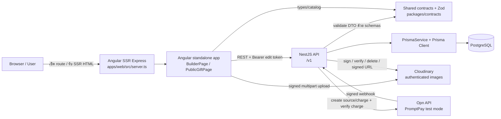
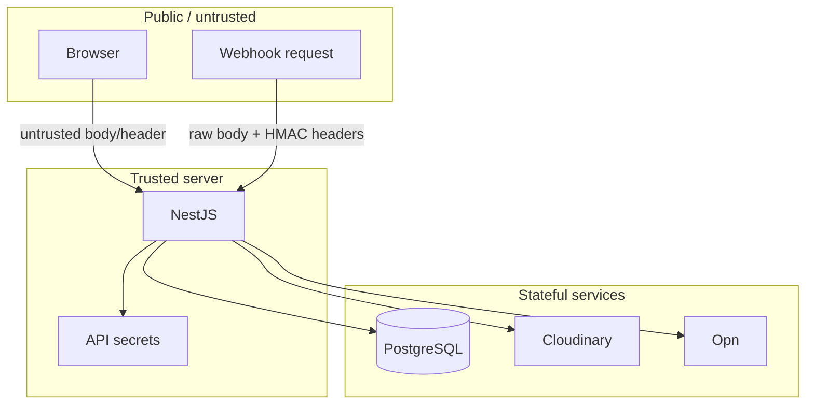
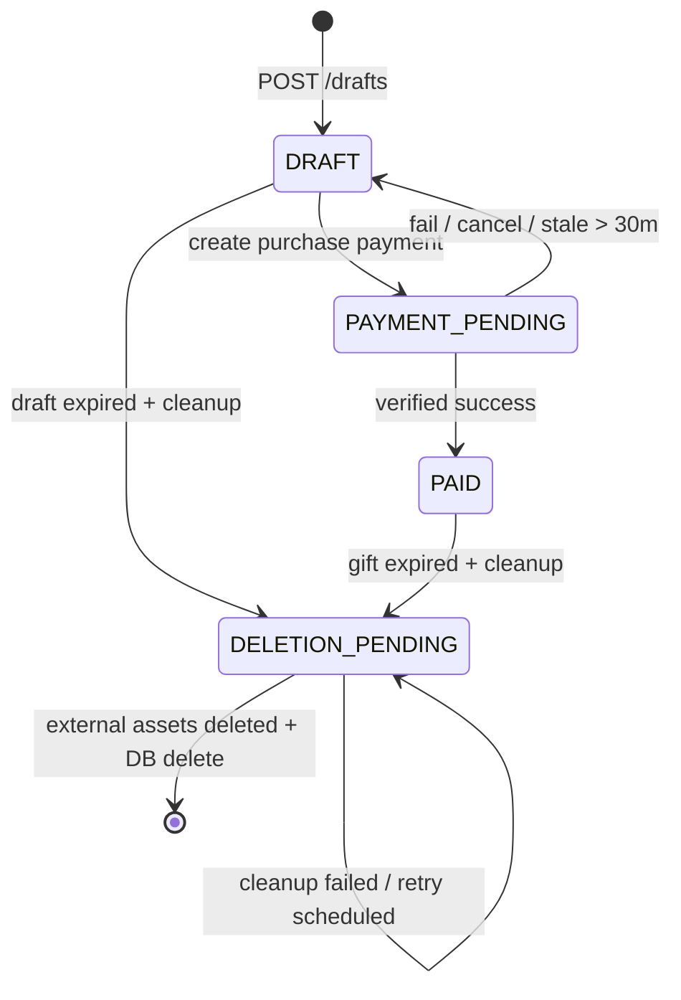

# System Overview

เอกสารนี้อธิบายระบบจาก implementation ที่ตรวจใน `apps/web`, `apps/api`, `packages/contracts`, Prisma schema, migration, seed และ E2E tests ณ วันที่ 20 สิงหาคม 2026 ไม่ได้อนุมานจากชื่อไฟล์เพียงอย่างเดียว

## ระบบนี้ทำอะไร

`ApoRaviz_Gift` เป็นระบบสร้างของขวัญดิจิทัลแบบ guest-only ผู้สร้างเลือกโอกาส/Template/แพ็กเกจ อัปโหลดรูป เขียนข้อความ ดู preview ที่มีลายน้ำ ทดลองจ่ายหรือจ่ายผ่าน Opn PromptPay test mode แล้วได้ public link สำหรับผู้รับเปิดภาพทีละใบ ระบบไม่มี account, login, JWT, role หรือ admin UI

## Runtime Architecture

## Technology Stack ที่พบจริง

| Layer | Technology | หลักฐานใน source |
|---|---|---|
| Workspace | npm workspaces, Node 24, npm 11 | `package.json` (`workspaces`, `engines`) |
| Frontend | Angular 22 standalone components, Router, signals, Forms, HttpClient with Fetch | `apps/web/package.json`, `app.config.ts`, `builder.page.ts` |
| SSR | Angular SSR + Express 5 | `angular.json` (`outputMode: server`), `main.server.ts`, `server.ts` |
| UI | Tailwind CSS 4, forms plugin, Angular CDK drag-drop, Heroicons | `styles.css`, `BuilderPage.imports`, `builder.page.html` |
| Backend | NestJS 11, Express adapter, Config, Schedule, Throttler | `apps/api/src/app.module.ts`, `main.ts` |
| Validation/contracts | Zod 4 และ TypeScript DTO interfaces | `packages/contracts/src/index.ts`, `ZodValidationPipe` |
| ORM/database | Prisma 7 + PostgreSQL adapter `pg` | `PrismaService`, `prisma.config.ts`, `schema.prisma` |
| Media | Cloudinary Node SDK, authenticated signed upload/delivery | `CloudinaryService` |
| Payment | mock provider และ Opn REST API ผ่าน native `fetch` | `PaymentsService`, `OpnService` |
| Tests | Jest, Angular/Vitest runner, Supertest, Playwright | package scripts และ `e2e/` |

## Component Boundaries

### Browser / Angular

- เริ่มที่ `apps/web/src/main.ts` → `bootstrapApplication(App, appConfig)`
- `App` แสดงเพียง `<router-outlet>`; route lazy-load `BuilderPage` หรือ `PublicGiftPage`
- ถือ UI state ด้วย Angular `signal`/`computed`
- เก็บ edit token และ pending payment ID ใน `localStorage`
- อัปโหลดรูปตรงไป Cloudinary ด้วย signature ที่ API ออกให้
- ไม่มี database หรือ provider secret ใน browser

### Angular SSR server

- `apps/web/src/server.ts` เสิร์ฟ static files, ใส่ security headers แล้วส่ง route ที่เหลือให้ `AngularNodeAppEngine.handle()`
- ทุก route ใช้ `RenderMode.Server` จาก `app.routes.server.ts`
- ใน production frontend ใช้ API base `/api/v1`; repo ไม่มี reverse-proxy implementation ที่ map path นี้ไป NestJS จึงเป็น `Unable to determine from current source code` ว่า production infrastructure จะ route อย่างไร

### NestJS API

- `apps/api/src/main.ts::bootstrap()` สร้าง app ด้วย `rawBody: true`, JSON logger, prefix `/v1`, CORS และ shutdown hooks
- `AppModule` ประกอบ Config, global throttling, scheduler, database, media, gifts, payments และ lifecycle modules
- Controller รับ HTTP และแปลง header/path/body; business rules อยู่ใน `GiftsService`/`PaymentsService`
- API stateless ยกเว้นข้อมูลใน PostgreSQL; edit token ที่รับเข้ามาไม่ถูกเก็บแบบ plaintext

### PostgreSQL

- เป็น source of truth ของ draft, media reservation, payment, webhook event, package และ lifecycle
- Prisma Client ถูกสร้างใน `PrismaService`; transaction และ advisory lock ป้องกัน concurrent update/cron ซ้ำ
- Relation หลักคือ `Gift 1—N GiftMedia` และ `Gift 1—N Payment`; cascade delete ลบ children ตาม gift

### Cloudinary

- API กำหนด `public_id`, transformation, asset type และสร้าง signature ด้วย secret
- Browser ส่งไฟล์ตรงไป Cloudinary จึงไม่ส่งไฟล์ขนาดใหญ่ผ่าน NestJS
- หลัง upload API เรียก Admin API ตรวจ metadata จริงก่อนเปลี่ยน media จาก `RESERVED` เป็น `READY`
- public gift ได้ signed delivery URL จาก API ไม่ได้ public URL ถาวร

### Opn

- `OpnService.createPromptPay()` สร้าง source ด้วย public test key และ charge ด้วย secret test key
- payment เริ่ม `PENDING`; browser poll เพื่อแสดงผลเท่านั้น
- การปลดล็อกเกิดใน backend หลัง webhook/reconciliation ดึง charge จาก Opn แล้วตรวจ paid/status/currency/amount/metadata ครบ

## Trust Boundaries

- Frontend checks เช่น file type/count และ wizard guards เป็น UX เท่านั้น; backend ตรวจซ้ำ
- `Authorization: Bearer <edit-token>` เป็นสิทธิ์แก้ guest draft ไม่ใช่ OAuth/JWT
- `Idempotency-Key` ป้องกันสร้าง payment ซ้ำ แต่ไม่ใช่ credential
- Cloudinary API key ถูกส่ง browser ได้; `CLOUDINARY_API_SECRET`, `OPN_SECRET_KEY`, `OPN_WEBHOOK_SECRET`, `DATABASE_URL` ต้องอยู่ server เท่านั้น

## State Machines

Payment แยกเป็น `PENDING → SUCCEEDED | FAILED`; renewal ไม่เปลี่ยน gift ออกจาก `PAID` แต่ขยาย `giftExpiresAt` จาก expiry เดิม

## Source of Truth ตามชนิดข้อมูล

| ข้อมูล | Source of truth |
|---|---|
| Request/response validation และ template catalog | `packages/contracts/src/index.ts` |
| ราคาที่ checkout ใช้จริง, image limit, validity | row ใน `packages` ณ เวลาทำ transaction |
| Gift/payment lifecycle | PostgreSQL |
| Template หลังซื้อ | `gifts.template_snapshot` |
| Package หลังซื้อ | `gifts.package_snapshot` (บันทึกไว้ แต่ runtime ปัจจุบันยังไม่อ่านกลับ) |
| ไฟล์ภาพ | Cloudinary; DB เก็บ identifiers/metadata/order |
| Product rules | `spec-summary.md` |

## ข้อจำกัดที่ยืนยันจาก source

- ไม่มี login/account/password/email/search/admin/card payment/video/export/deployment implementation
- มี 3 Angular routes แต่ builder route เดียวแบ่ง UI เป็น 6 internal steps
- production deployment และ reverse proxy ไม่อยู่ใน repo
- external network tests ถูก mock; credentialed Cloudinary/Opn smoke test ไม่ได้อยู่ใน automated flow
